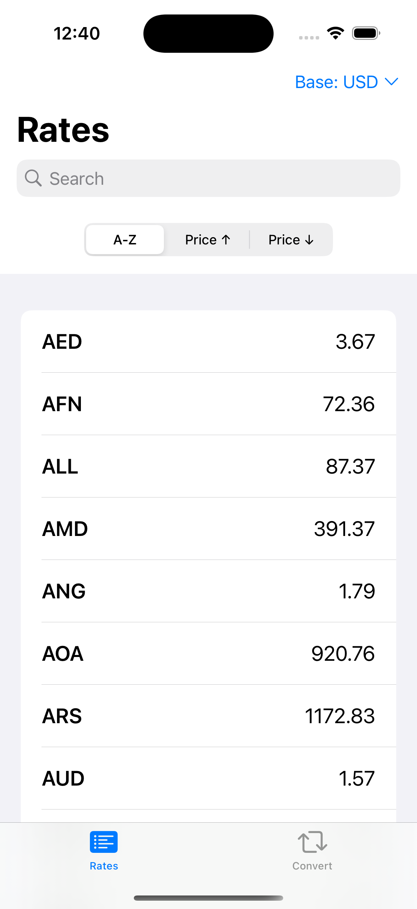
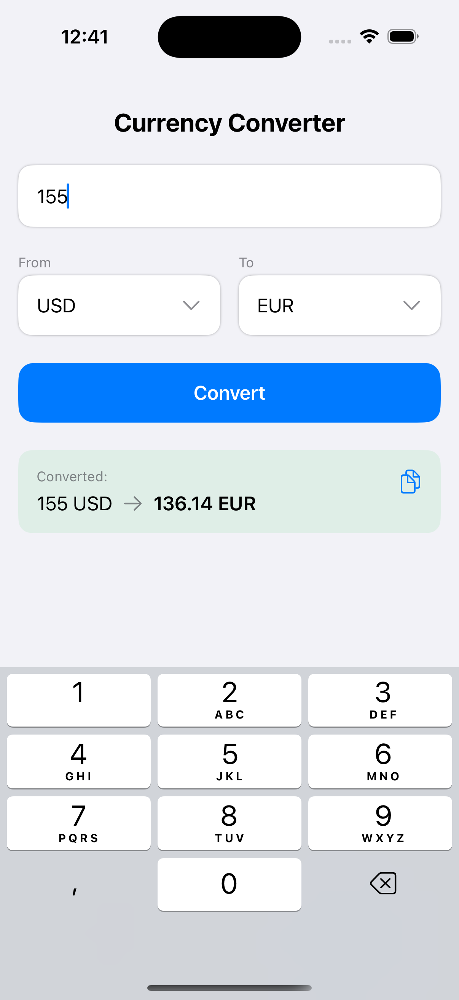

# XCur

**XCur** — минималистичное iOS-приложение для просмотра актуальных курсов валют и быстрой конвертации.  
Сделано с нуля на SwiftUI с акцентом на чистую архитектуру и отзывчивый интерфейс.

---

## 🔹 Возможности

- Курсы валют в реальном времени
- Поиск по валютам
- Сортировка: A-Z, по курсу (↑ / ↓)
- Быстрый выбор базовой валюты
- Конвертер с поддержкой копирования результата
- Анимации и шиммеры для плавного UX

---

## 🧱 Архитектура

- **MV + VM**: каждая вьюшка — глупая, вся логика внутри `ViewModel`
- **State + Action**: унифицированный протокол для управления состоянием
- **DI через структуры**: без протоколов, через `CurrencyService.live/mock`
- **Async/Await**: вся работа с сетью — через Swift Concurrency
- **Tuist**: структура проекта и зависимости

---

## 🧩 Основные экраны

### 🔹 RatesView
Список курсов с сортировкой и поиском  
Поддерживает смену базовой валюты и показывает результат в реальном времени

### 🔹 ConverterView
Конвертер между валютами с кастомной клавиатурой  
Поддерживает копирование результатов, а также отображает ошибки и состояния

---

## 🖼 Скриншоты
| Rates | Convert |
|-------|---------|
|  |  |

---

## 🧠 Технологии

- Swift 5.9
- SwiftUI
- Swift Concurrency
- URLSession
- Custom State Management
- Tuist
